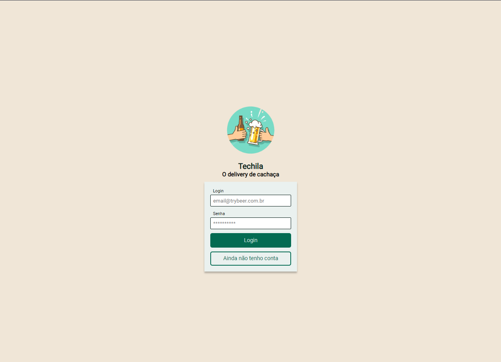

<h1 align="center"> 📦 AppDelivery 📦 </h1>

<div align="center">



</div>

## 📓 Descrição


 Este projeto foi feito em equipe com intuído de nos desafiarmos a construir um projeto full stack para um app de delivery genérico.


<details>
  <summary>Sobre o desenvolvimento</summary>
  <br />

  Utilizamos como base para contração da nossa equipe de desenvolvimento 2 métodos ágeis de desenvolvimento de software, o Scrum e o Kanban. O Scrum foi utilizado para a administração da equipe e das sprints e o Kanban para organizar o projeto.
  Utilizamos para desenvolver tecnologias baseadas em javascript, como React.js para o front end e node.js para o back end. Para o banco de dados utilizamos o MySQL, para a comunicação entre o front e o back utilizamos o ORM Sequelize para construir a API.
  Para a organização do projeto utilizamos o Trello e para a comunicação entre a equipe utilizamos o Discord e o Zoom.

  <br />
</details>
  <br />

### Habilidades e Tecnologias 💻

<details>
  <summary> 🦾 Habilidades 🦾</summary>
  <br />

* Desenvolvimento de aplicações React
* Desenvolvimento de aplicações Node.js
* Modelagem de banco MySQL
* Utilização de ORM Sequelize
* Utilização de bibliotecas de terceiros
* Trabalho em equipe
* Metodologias ágeis
* Utilização de ferramentas de comunicação e organização
* Criatividade
* Resolução de problemas
* Comunicação
* Organização
* Planejamento
* Autonomia

  <br />
</details>

<details>
  <summary> 🖥️ Tecnologias utilizadas 🖥️</summary>
  <br />

* React.js
* Styled Components
* Axios
* React Router
* Redux
* Hooks
* Node.js
* MySQL
* Sequelize
* Trello
* Discord
* Zoom
* Git
* GitHub
* JWT
* Bcrypt
* Docker
* PM2


  <br />
</details>

  <br />

### 📚 Documentação 📚

  <details>
    <summary> 🚀 Rodando o projeto 🚀</summary>
    <br />

  * Clone o repositório com o comando `git clone git@github.com:Erik-EFL/AppDelivery.git`
  * Entre na pasta do projeto com o comando `cd AppDelivery`

  * Para rodar o projeto, você precisará ter instalado em sua máquina o [Node.js](https://nodejs.org/en/), o [Docker](https://www.docker.com/) e caso não queira usar o docker(Recomendo que use) instale o [MySQL](https://www.mysql.com/) e . Caso não tenha, siga os passos de instalação de cada um deles.

  * Para começar vamos executar o comando `npm run docker` para iniciar o container do MySQL.
  * Agora vamos executar o comando `npm run startProject` para instalar as dependências e popular com as tabelas o banco de dados.

  * Agora vamos executar o comando `npm start` dentro da pasta back e front-end.
  * Para isso execute no seu terminal o comando `cd back-end` e depois `npm start` e depois `cd ../front-end` e `npm start`.

  * Agora você pode acessar o projeto no seu navegador através do endereço `http://localhost:3000/`

  <br />
  </details>
<br />


### 🤝 Colaborador 💻

<br />
<table>
  <tr>
      <td align="center">
      <a href="https://github.com/erik-efl">
        <br>
        <sub>
          <b>Erik Lima</b>
        </sub>
      </a>
    </td>
      <td align="center">
      <a href="https://github.com/kingreto1">
        <br>
        <sub>
          <b>Gabriel Melo</b>
        </sub>
      </a>
    </td>
      <td align="center">
      <a href="https://github.com/Thiago-Bodnar">
        <br>
        <sub>
          <b>Thiago Bodnar</b>
        </sub>
      </a>
    </td>
      <td align="center">
      <a href="https://github.com/tcorrea">
        <br>
        <sub>
          <b>Thiago de Carvalho Corrêa</b>
        </sub>
      </a>
    </td>
  </tr>
</table>

<br />

##

### 🚩 Implementações por vir 🚩

<details>
  <summary> 📌 Alterações futuras 📌</summary>
  <br />

* Implementação de testes unitários

  <br />
</details>

<br />
<br />

## ⚙️ Status do Projeto 🛠️

  ```js
    let projeto {
      "status": "Em desenvolvimento"
    }
  ```
##

### ©️ Aviso de direitos autorais

Desenvolvi este projeto para propósitos de aprendizagem, todo o código e documentação são de minha autoria e os direitos me pertencem exclusivamente. É permitido baixar ou clonar o repositório para fins de estudo. Contudo, não é permitido publicar cópias totais ou parciais. Este aviso não cobre bibliotecas e dependências, estas estão sujeitas a suas respectivas licenças.
